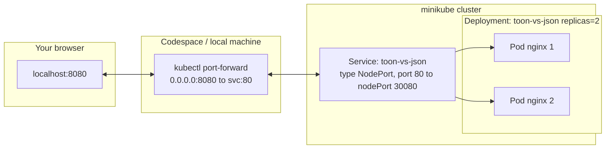

# TOON vs JSON on Kubernetes

A static page comparing [TOON](https://github.com/toon-format/toon) (Token-Oriented
Object Notation) against JSON — same data, side by side, with token/character
savings — served by nginx and deployed to a **minikube** cluster, either on
your own machine or inside a **GitHub Codespace**.

## Links

- Repo: https://github.com/rifaterdemsahin/ToonVsJsononKubernetes
- This README: https://github.com/rifaterdemsahin/ToonVsJsononKubernetes/blob/main/README.md
- Deployment log (every step taken, local + Codespaces): [DEPLOYMENT.md](DEPLOYMENT.md)
- Demo page source: [site/index.html](site/index.html)
- Container image definition: [Dockerfile](Dockerfile)
- Kubernetes manifests: [k8s/deployment.yaml](k8s/deployment.yaml), [k8s/service.yaml](k8s/service.yaml)
- Codespaces devcontainer: [.devcontainer/devcontainer.json](.devcontainer/devcontainer.json)
- Automated deploy script: [scripts/codespaces-deploy.sh](scripts/codespaces-deploy.sh)
- Open a Codespace for this repo: https://github.com/codespaces/new?repo=rifaterdemsahin/ToonVsJsononKubernetes
- Create/list Codespaces from the CLI: `gh codespace create -R rifaterdemsahin/ToonVsJsononKubernetes`

### Live example from this session (`glowing-space-goggles-p9wx456xvwfrp79`)

- Codespace web IDE: https://glowing-space-goggles-p9wx456xvwfrp79.github.dev
- Forwarded demo page (port 8080 → the minikube Service): https://glowing-space-goggles-p9wx456xvwfrp79-8080.app.github.dev/

**These URLs are not stable — don't bookmark them as *the* link to this project.** Every
Codespace gets a randomly generated name (`glowing-space-goggles-p9wx456xvwfrp79` here), and
that name is baked into both the `*.github.dev` IDE URL and the `*-<port>.app.github.dev`
forwarded-port URL. A Codespace is an immutable, disposable VM: stop or delete it and the name
is gone for good; create a new one (even from the same repo/branch) and you get a different name
and therefore different URLs. The two links above will work only while this specific Codespace
exists and is running — use the **Open a Codespace for this repo** link above to create your own
current one instead.

## How to start and see it

### Option A — GitHub Codespaces (no local setup)

1. Open the repo in a Codespace: https://github.com/codespaces/new?repo=rifaterdemsahin/ToonVsJsononKubernetes
   (or from the repo page: **Code → Codespaces → Create codespace on main**).
2. Wait for the devcontainer to build. `postCreateCommand` runs
   [scripts/codespaces-deploy.sh](scripts/codespaces-deploy.sh) automatically, which starts
   minikube, builds the image inside it, and applies the manifests — no manual steps.
3. Codespaces detects port `8080` (declared in `devcontainer.json` → `forwardPorts`) and
   opens it in a browser tab automatically. If it doesn't, open the **Ports** tab
   at the bottom of the editor and click the globe icon next to `8080`.

### Option B — Local (macOS/Linux with Docker + minikube installed)

```bash
minikube start --driver=docker
eval $(minikube docker-env)          # point the docker CLI at minikube's own daemon
docker build -t toon-vs-json:latest .
kubectl apply -f k8s/deployment.yaml -f k8s/service.yaml
kubectl rollout status deployment/toon-vs-json
kubectl port-forward svc/toon-vs-json 8080:80
```

Then open http://localhost:8080.

## Networking: ingress and egress

This demo deliberately uses the **smallest networking surface that works**,
and every layer maps to a real k8s primitive:



**Ingress (traffic coming in):**

- The `Service` in [k8s/service.yaml](k8s/service.yaml) is `type: NodePort`, which opens
  `30080` on every cluster node and load-balances across whichever pods match
  `selector: app: toon-vs-json` — that's the only in-cluster ingress rule needed for a
  demo with one route (`/`). There's no `Ingress` resource or ingress controller
  (nginx-ingress, Traefik, etc.) here on purpose: those exist to do host/path-based
  routing across *multiple* services, and this repo only has one. Adding one would be
  unused complexity for what this demo needs.
- Reaching that NodePort from outside the cluster still needs a hop, because minikube's
  node lives inside its own Docker container (or VM) — its IP isn't directly reachable
  from your laptop's or Codespace's browser. `kubectl port-forward svc/toon-vs-json 8080:80`
  opens a tunnel: local `8080` → the Kubernetes API server → the Service → a Pod. It's the
  lowest-friction option for a single-service demo (`minikube service` and `minikube tunnel`
  are the alternatives — see below).
- In Codespaces specifically, `devcontainer.json`'s `forwardPorts: [8080]` adds *another*
  hop on top: Codespaces forwards its own container's `8080` out to a public-ish HTTPS URL
  your browser can reach, and proxies that back to the `kubectl port-forward` process
  running inside the container.

**Egress (traffic going out):**

- The nginx pods make **no outbound calls** — `site/index.html` is fully self-contained
  (inline `<style>`/`<script>`, no CDN, no API calls), so there's nothing to allow-list.
- The only egress that matters is at build time: `docker build` pulls the `nginx:alpine`
  base image from Docker Hub. After that, the image is built directly inside minikube's
  own Docker daemon (`eval $(minikube docker-env)`) and referenced with
  `imagePullPolicy: Never` in [k8s/deployment.yaml](k8s/deployment.yaml) — so the *running*
  cluster never needs a container registry or further internet egress to deploy or restart.
- No `NetworkPolicy` is defined, i.e. egress/ingress between pods is unrestricted by
  default. That's fine here (single app, no secrets, no other tenants in the cluster) —
  it would be the wrong default in a shared or multi-app cluster, where you'd want a
  default-deny `NetworkPolicy` and explicit allow rules per service.

**Other ways to expose the Service** (not used here, but worth knowing):

| Method | What it does | Why not used here |
|---|---|---|
| `kubectl port-forward` (what this repo uses) | Direct tunnel from a local port to the Service, via the API server | Simple, works identically on macOS and Codespaces, no extra privileges |
| `minikube service toon-vs-json` | Opens/prints a browser-ready URL, driver-dependent | On the `docker` driver on macOS it blocks holding a tunnel open, which doesn't suit an automated script |
| `minikube tunnel` | Runs a routing daemon so `type: LoadBalancer` Services get a real routable IP | Overkill for one NodePort Service; needs a long-lived sudo process |
| `Ingress` + ingress controller | Path/host-based L7 routing across many Services, TLS termination | Only pays off with more than one route/service |

## Why TOON over JSON (what the page demonstrates)

TOON keeps JSON's data model (same scalar types, lossless round-trip) but drops the
per-object key repetition and bracket/quote overhead that make JSON expensive to hand to
an LLM as context: an array of objects declares its shape once
(`users[4]{id,name,role}:`) and then streams plain rows, instead of repeating
`"id"`, `"name"`, `"role"` for every element. The page renders the same sample data both
ways and estimates the character/token savings live — see [site/index.html](site/index.html).
